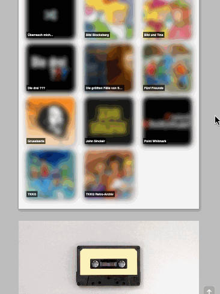

# random-episode-frontend

I really love audio dramas, espacially "Die drei ???"
(_Three Investigators_)!

But sometimes it's really hard to find the right episode that
fits my mood.
Also, my wife is not a good randomizer. When I ask her for an
episode ID, she answers "73!" most of the time 😉
. But episode 73 of "Die drei ???" is "Poltergeist" which is not
a good episode if you want to listen to something while you try
to fall asleep 👻 😱

So, there was only one way out: I had to develop my own random
episode generator!

## Blog

You can read about random-episode on
[my blog](https://thr0n.github.io/how-to-solve-an-everyday-problem-with-node-js-gatsby-and-netlify)
or on my
[dev.to](https://dev.to/thr0n/how-to-solve-an-everyday-problem-with-node-js-gatsby-and-netlify-11fm) page.

I've also made a small screen recording if you are curious how
random-episode works and looks like:

## Unplash credits

Both tape images are taken from Unsplash:

- https://unsplash.com/photos/FZWivbri0Xk
- https://unsplash.com/photos/jiVZRS-6PbU
