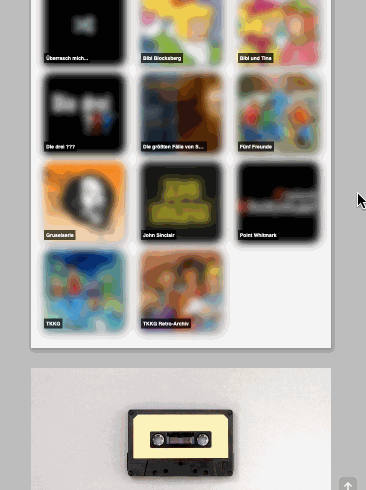

# random-episode-frontend

I really love audio dramas, espacially "Die drei ???"
(_Three Investigators_)!

But sometimes it's really hard to find the right episode that
fits my mood.
Also, my wife is not a good randomizer. When I ask her for an
episode ID, she answers "73!" most of the time 😉
. But episode 73 of "Die drei ???" is "Poltergeist" which is not
a good episode if you want to listen to something while you try
to fall asleep 👻 😱

So, there was only one way out: I had to develop my own random
episode generator!

> I will soon publish a blog article about the development of random-episode.
> I will link it here, so you can learn more about it if you want.

## Auth0

On February 17th, 2021 I added Auth0 authentication to random-episode.
I think this is a good idea since I do not want to be sued for using
episode covers or episode titles to which I have no rights.
So, from now on this is a "private" project, I'm very sorry! 🙁

I made a small screen recording if you are curious how
random-episode works and looks like:

## Unplash credits

Both tape images are taken from Unsplash:

- https://unsplash.com/photos/FZWivbri0Xk
- https://unsplash.com/photos/jiVZRS-6PbU
